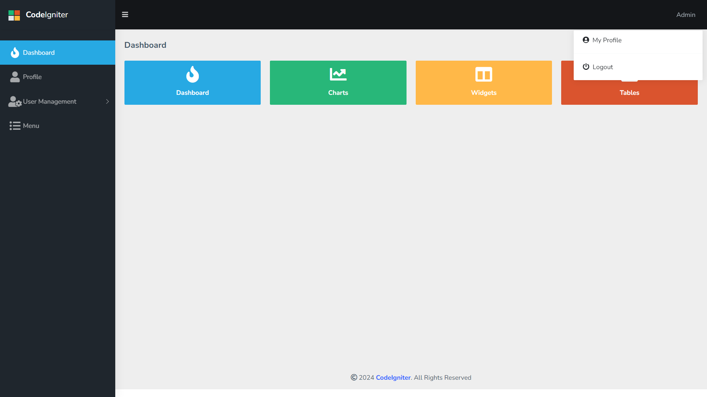
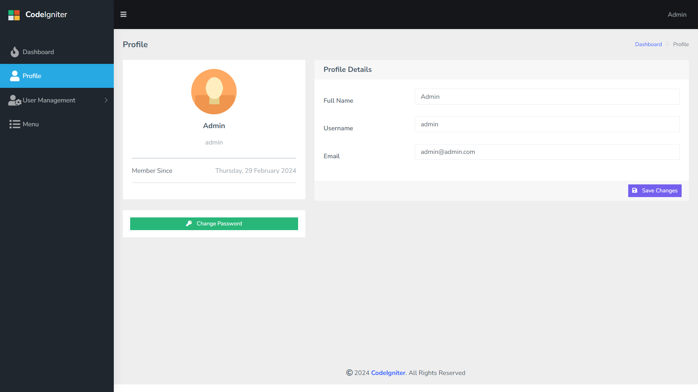
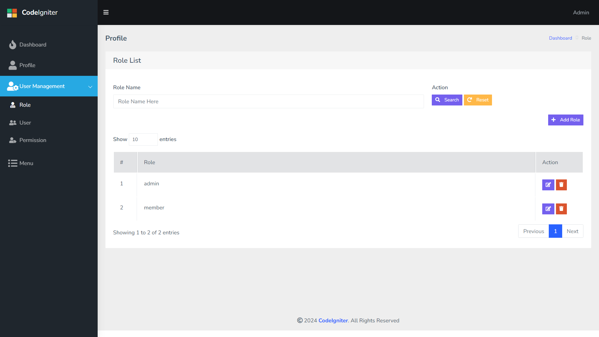
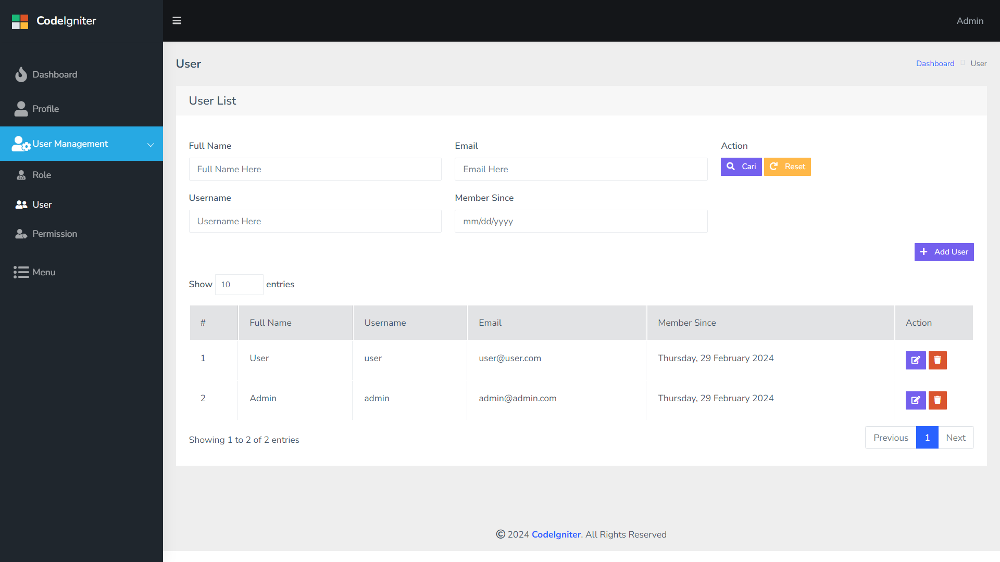
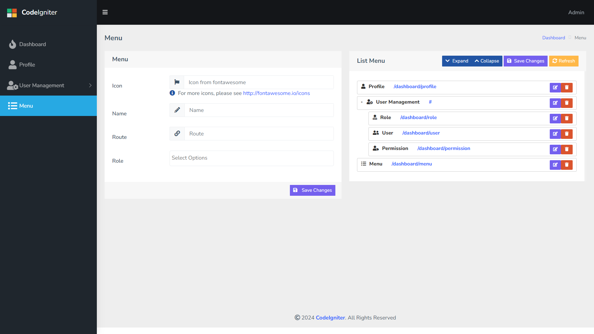

# CodeIgniter 4 Application Starter + Authentication

## Description
This application is a starting point for creating a system because it was built using CodeIgniter 4 and is equipped with authentication so there is no need to bother creating it from scratch

## Minimum Requirements
- PHP 8 or later
- MySQL 8
- CodeIgniter 4 or higher


## Features
- A customized system inspired by the <a href="https://github.com/agungsugiarto/boilerplate">agungsugiarto/boilerplate</a> project
- Dashboard admin template from <a href="https://github.com/wrappixel/matrix-admin-bt5">Matrix Admin</a>
- Using Server-side Datatables library from <a href="https://github.com/hermawanramadhan/CodeIgniter4-DataTables"> hermawanramadhan/CodeIgniter4-DataTables</a>
- Using <a href="https://github.com/lonnieezell/myth-auth">lonnieezell/myth-auth</a> as system authentication

## Installation

1. Clone the project to your computer with the `git clone` command or download the code with the download zip.
2. Navigate to the project directory and install the project with the command `composer install`.
3. Copy `env` to `.env` and customize it to suit your application, especially the baseURL and adjust the database naming and settings.
4. Run database migrations with the command `php spark migrate`. This command will create database tables according to the definitions in the migration files.
5. Then run the `php spark db:seed AllSeeder` command to input the data needed for the system to run.
6. Steps 4 and 5 can be replaced by directly importing the `db-auth.sql` file into the database.
7. Run the project with the command `php spark serve`.
8. Open your web browser and access the address `http://localhost:8080`.


## Settings
If you want to change the system name, icon, footer, you can open `app/config/App.php`

```php
public $appName = 'CodeIgniter';
public $theme = [
    'logo' => [
        'brand' => [
            'icon' =>'/assets/images/logo-icon.png',
            'width' => 25,
            'height' => '',
            'text' => '<strong>Code</strong>Igniter',
        ],
        'favicon' => '/favicon.ico',

    ],
    'footer' => [
        'vendorname' => 'CodeIgniter',
        'vendorlink' => 'https://www.codeigniter.com',
    ],
];
```

## Default User

| Username  | Password |
| --------- | --------- |
| admin  | super-admin  |
| user | super-user  |

## Screenshots







## Licenses
This project is licensed under the terms of the MIT license